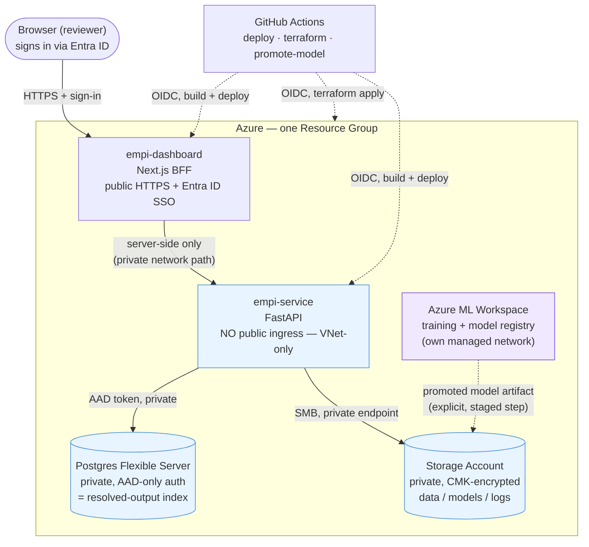
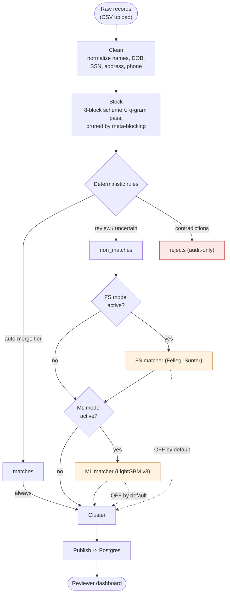
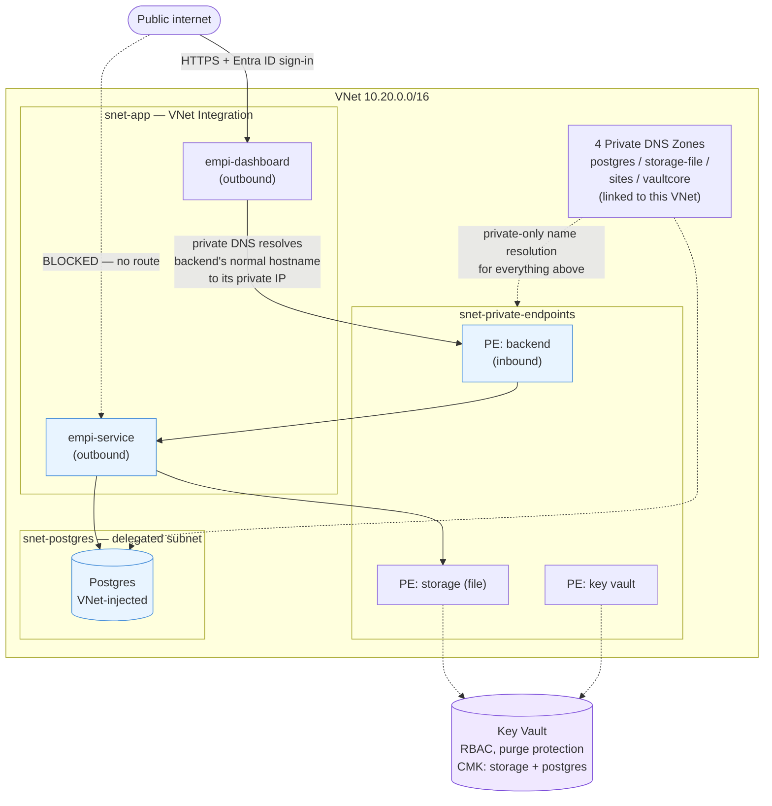
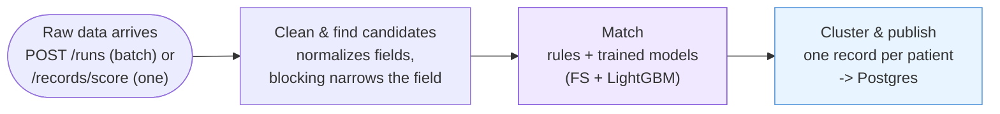
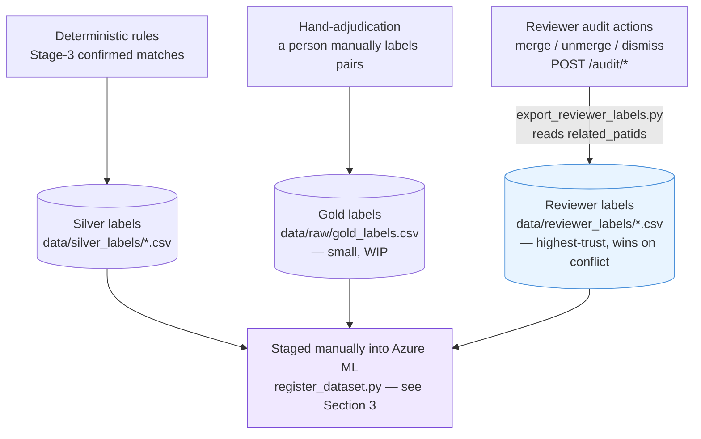
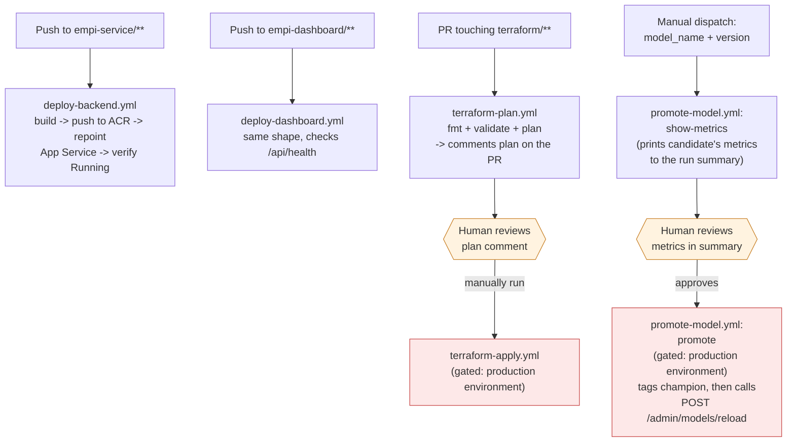
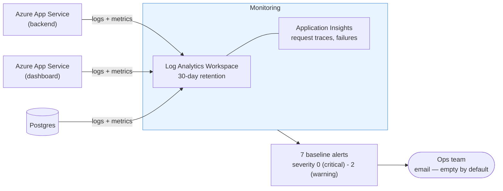

# eMPI — Architecture Diagrams

Client-facing reference, refreshed 2026-07-26 to reflect the current
deployed architecture (VNet/private endpoints, Entra ID SSO, Azure ML,
CI/CD, model hot-reload, observability, cost) — the previous version of
this doc predated all of that and showed the original public-everything,
no-auth topology. Source of truth for every claim here:
`terraform/README.md`, `terraform/*.tf`, `empi-service/docs/API-Design.md`,
`empi-model-training/README.md`, and `.github/workflows/*.yml`. Structured
to match the eight sections of the client deck this feeds
(`AllianceChicago_MPI_Deck_Templates.pptx`-branded): Overview, Networking,
MLOps (AML), Data Architecture, CI/CD, Scalability, Performance &
Resiliency, Observability & Telemetry, FinOps.

---

## 1. Overview of architecture

Three tiers, plus the training/CI layer around them:

**The headline change since the original design:** every data-bearing
component (backend, Postgres, Storage) is now private-only, reachable
solely from inside Azure's network — not just "secured," genuinely
unreachable from the public internet. The dashboard is the one deliberate
exception, since a browser has to reach it, and it now requires Entra ID
sign-in to do so.

### API routes: what the dashboard actually calls

The dashboard is a server-side BFF (`empi-dashboard/src/lib/server-api.ts`)
— the browser never calls the backend directly, and every Next.js Route
Handler under `src/app/api/*` proxies to exactly one FastAPI route
one-to-one. Ground-truthed from the actual `apiGet`/`apiPostJson`/
`apiPostForm` call sites, not inferred from route names:

| Dashboard BFF route | Backend route | What it's for |
|---|---|---|
| `GET/POST /api/runs`, `GET /api/runs/[runId]` | `GET/POST /runs`, `GET /runs/{run_id}` | Upload new data; check a pipeline job's status |
| `GET /api/records`, `GET /api/records/[patid]/raw`, `GET /api/clusters/[mid]` | `GET /records`, `GET /records/{patid}/raw`, `GET /clusters/{mid}` | Browse the matched-patient dataset |
| `GET /api/review-queue` | `GET /review-queue` | What needs a reviewer's judgment call |
| `GET /api/audit`, `POST /api/audit/{merge,unmerge,dismiss}` | same paths, no `/api` prefix | Merge, unmerge, dismiss — every action logged |
| `GET /api/dashboard/summary` | `GET /dashboard/summary` | The home-page match-rate stats |
| `GET /api/health` | `GET /health/ready` | Is the backend up and the database reachable |

**Not called by the dashboard** — served for other callers:

- `GET /health` — a bare liveness ping for Azure's own platform monitoring,
  not a reviewer action (the dashboard's own health check uses the richer
  `/health/ready`, which also verifies the database).
- `POST /records/score` / `GET /records/score/{run_id}` — scores one record
  at a time for an external system, bypassing the full batch pipeline;
  separate from the dashboard's own dataset browsing.
- `POST /admin/models/reload` / `GET /admin/models/status` — ops-only; see
  §3's "Getting a promoted model live" below.

### Entity-resolution pipeline (unchanged by this pass)

None of the infrastructure/MLOps work changed the pipeline's own logic —
included here for completeness:

FS and ML score and gate candidates as audit/decision-support; only
deterministic rules feed the automatic merge decision today (both
`*_feeds_clustering` flags default off). Both matcher models are now
trained via the Azure ML pipeline in Section 3 — see that section for how a
trained artifact gets from Azure ML back into what this diagram serves.

---

## 2. Networking

**What each piece buys, in plain terms:**

| Component | What it means |
|---|---|
| **No public ingress on the backend** | Not "firewalled" — there is no route from the public internet to it at all. Only reachable from inside this VNet. |
| **Dashboard stays public** | Necessary — a browser has to reach it — but it now requires Entra ID sign-in, and its calls to the backend route privately (split-horizon DNS: the same hostname resolves to a private IP from inside the VNet). |
| **Postgres: VNet-injected** | Azure's supported private-connectivity model for Postgres Flexible Server (not a Private Endpoint — a dedicated delegated subnet instead). Same effect: no public reachability. |
| **Storage + Key Vault: Private Endpoints** | Standard Azure pattern for services that don't support VNet injection. Both also encrypt with **customer-managed keys** stored in that same private Key Vault. |
| **4 Private DNS zones** | The mechanism that makes "the same hostname resolves differently inside vs. outside the VNet" work — without them, VNet Integration alone wouldn't route traffic to the private endpoints. |

**Real operational trade-offs, not just a config flip:**

- A GitHub-hosted CI runner can't curl the backend's `/health` directly anymore (no route in) — deploy verification now checks Azure's own "is it running" status instead of an actual HTTP probe.
- Debugging the backend directly from a laptop (`curl`, Postman) needs a VPN/bastion into the VNet now.
- The one-off "train an FS model on the deployed box" step needs the same VNet access, or a temporary, deliberate flip of the public-access flag.

None of these are oversights — they're the direct, expected consequence of
"no public ingress," documented in `terraform/README.md` alongside the
workaround for each.

### Why segmented into separate subnets?

Not arbitrary tidiness — two of the three subnets are hard platform
requirements, not design choices:

- **Postgres gets its own subnet, no exceptions.** Azure requires a subnet
  delegated to Postgres Flexible Server to hold nothing else
  (`terraform/networking.tf`'s own comment: "Azure requires the delegated
  subnet not be shared with other resource types").
- **The App Service subnet uses a different delegation.** Outbound VNet
  Integration for the dashboard and backend needs the `Microsoft.Web/
  serverFarms` delegation — a different, incompatible delegation type from
  Postgres's `Microsoft.DBforPostgreSQL/flexibleServers` — another reason
  they can't share a subnet even if we wanted them to.
- **Private Endpoints share one subnet by design**, not by requirement —
  Storage, Key Vault, and the backend's own inbound Private Endpoint don't
  need dedicated subnets. Grouping them lets one consistent set of network
  rules apply to everything being reached privately.
- **Four DNS zones, not one** — each Azure service (Postgres, Storage, App
  Service, Key Vault) publishes its Private Link records under its own
  fixed, Microsoft-defined zone name (`privatelink.postgres.database.
  azure.com`, etc.). Also not a choice available to us.
- **The payoff:** segmentation by function means a problem in one tier
  doesn't automatically have a path into another's address space — even
  before any additional NSG rules (not yet added — see `terraform/README.md`).

### Communication protocols

- **HTTPS/TLS everywhere public-facing** — the one thing a browser reaches,
  the dashboard, is TLS-encrypted end to end, sign-in included.
- **No passwords over the wire to Postgres** — the backend authenticates
  with a short-lived Azure AD token from its own managed identity, not a
  stored password (`postgres.tf`) — the same underlying idea as GitHub
  Actions' OIDC trust below.
- **SMB for the file shares** — data, model, and log files mount over SMB
  from Azure Files (`app_service.tf`'s `storage_account` blocks) — the same
  protocol a corporate network drive uses, just private and encrypted.
- **Private DNS gives one hostname two meanings** — split-horizon
  resolution: the backend's normal `*.azurewebsites.net` hostname resolves
  to its private IP from inside the VNet, and to nothing reachable from
  outside it.
- **OIDC federated identity for every automated action** — GitHub Actions
  never holds an Azure secret; each workflow run trades a short-lived,
  repo-scoped GitHub token for Azure access at run time (`github_oidc.tf`).

---

## 3. MLOps (Azure ML) for model training

Training and experiment tracking live in a separate Azure ML Workspace with
its **own managed network** — intentionally isolated from the VNet above,
not connected to it. Serving is unaffected: the backend still loads a model
file from private Storage and scores in-process; there are no live
endpoints in Azure ML.

```mermaid
flowchart LR
    subgraph LOCAL["empi-model-training (local or CI)"]
        stage["1. Stage training data\n(explicit copy from\nprivate Storage)"]
        regdata["2. Register Data asset\n(versioned)"]
        regenv["3. Register Environment\n(conda spec)"]
        submit["4. Submit job\n(preflight-checked)"]
    end

    subgraph AMLWS["Azure ML Workspace (own managed network)"]
        compute["Compute cluster\n(scale-to-zero)"]
        fscomp["FS matcher training\n(Splink)"]
        mlcomp["LightGBM v3 training"]
        mlflow_["MLflow tracking"]
        registry["Model Registry\n(versioned, tagged)"]
    end

    human["Human reviewer"]
    champion["Tag: champion"]
    share[("empi-models\nAzure Files share\n(private)")]
    backend["empi-service (backend)\nmodel cached in memory"]

    stage --> regdata --> submit
    regenv --> submit
    submit --> compute
    compute --> fscomp
    compute --> mlcomp
    fscomp --> mlflow_
    mlcomp --> mlflow_
    mlflow_ --> registry
    registry -->|"metrics surfaced\nfor review"| human
    human -->|approves| champion
    champion -.->|"explicit, staged copy\n(same network boundary\nas Section 2)"| share
    share -.->|"POST /admin/models/reload\n(no restart, no redeploy)"| backend

    style AMLWS fill:#f0e8ff,stroke:#7a4ad9
    style human fill:#fff3e0,stroke:#c9822a
    style backend fill:#e8f4ff,stroke:#4a90d9
```

**Why this is a genuine step up from where the models stood before:**

- Both matchers now have a **real, reproducible training entry point** —
  previously the LightGBM classifier's training procedure existed only as
  a notebook, run by hand.
- **Experiment tracking** (MLflow) and a **model registry** exist for the
  first time — every training run's parameters, metrics, and artifact are
  captured, not just the final pickle file.
- **A human approves every promotion** — a new model version doesn't
  become "champion" until someone reviews its metrics (Section 5 covers
  how).
- Training code is **fully independent** of the serving application code
  (`empi-service`) — no shared imports, faithful reimplementations kept
  deliberately in sync, tested end-to-end locally with real (not mocked)
  fits before ever reaching Azure ML.
- **Getting a promoted model live needs no restart.** Neither matcher was
  ever cached in memory before this pass — both re-read their model file
  from disk on every single pipeline run and every incremental score call,
  so a promoted model already took effect on the very next call with zero
  code changes. `src/models/model_cache.py` now caches both in memory
  (avoiding that repeated disk I/O once there's real traffic) keyed on the
  file's own path + mtime, so it self-invalidates the moment a promoted
  model's file changes — no staleness reintroduced. `POST
  /admin/models/reload` (§1's routes table) makes that cutover immediate
  and observable instead of waiting on whichever request happens to notice
  first: call it right after copying a promoted artifact into place, and
  its response confirms which model is now active before you consider the
  promotion done.

**One deliberate limitation to state plainly:** Azure ML's compute has no
network path to the app's private Storage (different network boundary, by
design — see Section 2's isolation). Getting training data in and a
promoted model *artifact* out is still a manual, staged, auditable copy —
not a pipeline that runs itself end-to-end unattended yet. What's no longer
manual is the last mile: once that artifact is in place, putting it live is
one API call away, not a restart or redeploy.

---

## 4. Data Architecture

How a record's data actually moves, end to end — ties together the
pipeline stages (unchanged by this pass) with the training/serving loop
Section 3 covers:

Everything after "Raw data arrives" happens inside the private network
(Section 2) — nothing in this flow is reachable from outside Azure. The
`Match` stage is where a trained model artifact (Section 3) actually gets
used, cached in memory rather than reloaded from disk per request
(`src/models/model_cache.py`).

### Where retraining data actually comes from

Reviewer actions in the dashboard (merge/unmerge/dismiss) **now feed
retraining directly**. Originally they didn't — `audit_log` only backed
record-locking and the audit trail — so `audit_log` gained a
`related_patids` column (a membership snapshot captured at write time;
`src/api/routers/audit.py`, `docs/Data-Contract.md` §6e) and
`scripts/export_reviewer_labels.py` turns every merge/unmerge/dismiss into
a `(PATID_A, PATID_B, reviewer_label)` pair — the highest-trust of the
three label sources, since it traces back to a live human decision, not a
proxy or a separate labeling pass.

- **Silver labels** are Stage-3 deterministic-rule confirmations — a
  high-precision proxy for ground truth, not hand-adjudicated
  (`src/models/fs_matcher/train.py`, `data/silver_labels/SCHEMA.md`).
- **Gold labels** are a separate, small, hand-adjudicated set — "the
  highest-trust label source in the project, but small and still a work
  in progress" (`data/raw/SCHEMA.md`, `docs/ML-Model-LightGBM-v3.md`).
- **Reviewer labels** derive from `audit_log`: a `merge` confirms every
  pairwise combination across the newly-added and pre-existing members as
  a match; an `unmerge` confirms the removed patid as a non-match against
  whoever stayed behind; a `dismiss` is already a direct non-match pair.
  Both `fs_train.py` (both repos) and `lightgbm_train.py` accept an
  optional `--reviewer-labels` alongside the primary source, with reviewer
  labels winning on any conflicting pair. **Not yet wired into
  `submit.py`** — works for local/direct-CLI training today, not jobs
  submitted straight to Azure ML (`empi-model-training/README.md`).
- All three get staged into Azure ML the same manual way as everything
  else in Section 3 — Azure ML's compute has no automatic path to either
  the app's storage or a live feed from the dashboard.

---

## 5. CI/CD

Four GitHub Actions workflows, all authenticating via OIDC federated
identity — no long-lived Azure secret is ever stored in GitHub:

**Two workflows are auto-triggered** (deploy-backend, deploy-dashboard) —
routine, low-risk, push-to-main. **Two require an explicit human approval**
via a protected GitHub Environment (`terraform-apply`, `promote-model`'s
`promote` job) — anything that changes cloud infrastructure or changes
which model version is live gets a deliberate human gate, not an automatic
one. This mirrors the same philosophy in both places: automate the routine,
keep a human in the loop for anything consequential.

**`promote-model.yml`'s `promote` job now does two things, in order, both
real, not aspirational:**

1. Tags the approved version `champion` in Azure ML's registry (clearing
   the previous champion tag first).
2. Calls `POST /admin/models/reload` (§1/§3) against the backend, so the
   already-copied artifact actually goes live — no restart, no redeploy.

**The one remaining manual link, stated plainly:** step 2 can only put a
model live if it's already sitting in the `empi-models` Azure Files share
— copying it there is still a manual, VNet-connected step (same limitation
as Section 2/3), and the workflow prints a loud warning to that effect
before attempting the reload call. The reload call **itself** also
requires that same VNet connectivity to reach the backend at all
(`terraform/networking.tf` — no public ingress); on the default
GitHub-hosted runner it will fail, on purpose, with a message pointing at
the fix (a self-hosted runner with VNet access, or run it manually) —
failing loudly here is correct, since it means the promotion did **not**
take effect, not that it silently did.

---

## 6. Scalability, Performance & Resiliency

- **Blocking keeps matching fast at scale** — instead of comparing every
  record to every other record, an 8-block scheme plus a q-gram similarity
  pass narrows the field first, pruned further by meta-blocking before
  anything gets scored (`src/preprocessing/stacked_blocking.py`).
- **Models load once, not on every request** — both matchers used to
  re-read their model file from disk on every single call; they're now
  cached in memory (Section 3) — real savings once there's live traffic.
- **Training scales to zero when idle** — the Azure ML compute cluster
  (`terraform/ml_workspace.tf`, `Standard_DS3_v2`, 0-2 nodes) spins up only
  while a model is actually training, then back to zero — no idle compute
  bill between training runs.
- **The backend still runs as a single instance today** — job status for
  pipeline runs and incremental scoring lives in memory
  (`src/api/jobs.py`'s `_REGISTRY`/`_SCORE_REGISTRY`) for fast reads, and
  now also durably on disk (see below) for crash recovery. A deliberate
  scope decision (see `to-do.md`), not an oversight — scaling the backend
  out horizontally to *multiple* instances would still need that moved to
  a shared store first.
- **Postgres and the App Service Plan both have headroom to grow** —
  today's tiers (Burstable Postgres, Premium v3 App Service) were sized for
  a presentation-stage deployment; the CPU/memory alerts (Section 7) are
  the signal to size up before it becomes a problem, not after.

### Resiliency: retries, durable job status, and a database the app no longer manages

Two gaps closed in this pass, neither touching the matching logic itself:

1. **Background jobs retry transient failures.** `run_pipeline_job` and
   `score_records_job` (`src/api/jobs.py`) each wrap their core work in a
   retry loop — up to 3 attempts with exponential backoff — before marking
   a job permanently failed. A momentary database hiccup or transient lock
   no longer fails a job on the first blip.
2. **Job status now survives a crash, not just success.** Every status
   transition (queued/running/succeeded/failed, attempt count, last error)
   is written to a durable file under `data/runs/` — extending the
   existing `RunManifest` pattern rather than adding a new database table.
   If the process dies mid-job (a redeploy, an OOM kill — there's no
   signal handling to flush state on a clean shutdown), `GET
   /runs/{run_id}` and `GET /records/score/{run_id}` read that file as a
   fallback once the in-memory registry is empty, and a startup
   reconciliation step (`main.py`'s `lifespan`) marks anything left
   "running"/"queued" from a previous process as interrupted. A client
   polling for a result now gets an honest "interrupted by restart,
   resubmit if needed" instead of a bare 404 indistinguishable from a
   run_id that never existed.
3. **The app no longer creates or alters its own database schema.**
   Previously, `lifespan`'s startup hook and `build_index_backend()` (the
   dependency used by nearly every route) both called `init_db()` —
   meaning the `CREATE TABLE IF NOT EXISTS` + column-migration dance ran on
   close to every request, not just app boot. Schema setup is now a single
   explicit script (`scripts/init_db.py`), run deliberately once per
   environment or after a code change adds a column — never automatically.
   The running app only ever *connects* to an already-correct database; a
   read-only startup check logs a loud error if the schema looks missing,
   instead of silently reconstructing it. This is what makes reviewer
   decisions (merges, unmerges, dismissals) durable across a deploy: a new
   version of the code can no longer accidentally alter or reset the live
   database as a side effect of starting up.

No new migration framework and no new database tables — both changes reuse
existing patterns (`_COLUMN_MIGRATIONS`, `RunManifest`-style files) rather
than adding new machinery, per an explicit scope constraint: migration
tooling is a larger decision for infra/code owners, not something to
introduce unilaterally in this pass.

---

## 7. Observability & Telemetry

Nothing in this section existed before this pass — the original deployment
shipped with no monitoring or alerting at all (`terraform/monitoring.tf`
is entirely new).

The 7 baseline alerts, all wired to one action group
(`azurerm_monitor_action_group.ops`):

| Alert | Trigger | Severity |
|---|---|---|
| `alert-backend-5xx` | Backend `Http5xx` > 5 in 5 min | 2 (warning) |
| `alert-backend-health` | Backend health check fails | 0 (critical) |
| `alert-dashboard-health` | Dashboard health check fails | 0 (critical) |
| `alert-plan-cpu` | App Service Plan CPU > 80% (15 min) | 2 (warning) |
| `alert-plan-memory` | App Service Plan memory > 85% (15 min) | 1 — the signal to bump `app_service_sku` |
| `alert-postgres-cpu` | Postgres CPU > 80% (15 min) | 2 (warning) |
| `alert-postgres-storage` | Postgres storage > 80% (30 min) | 1 (the signal to grow `postgres_storage_mb`) |

No app code depends on any of it, and local development never touches
Azure Monitor — purely additive, same principle as everything else in this
pass.

---

## 8. FinOps

**Estimate, not a quote.** Public Azure list pricing (pay-as-you-go, no
reservations or savings plans applied), approximate and region-dependent.
Verify against the Azure Pricing Calculator or actual Cost Management data
before budgeting.

| Category | What it covers | Est. $/mo |
|---|---|---|
| Compute | App Service Plan (P0v3) — hosts both backend and dashboard | $85–90 |
| Database | Postgres Flexible Server — Burstable, 32GB, 35-day geo-redundant backup | $20–30 |
| Storage & secrets | Storage Account (3 file shares) + Key Vault | $8–20 |
| Container registry | Azure Container Registry — Basic tier | $5 |
| Azure ML | Workspace storage + compute cluster (scales to zero when idle) | $10–30 |
| Monitoring | Log Analytics + Application Insights — first 5GB/mo free | $0–20 |
| Private networking | 3 Private Endpoints + 4 Private DNS zones | $23–29 |
| **Estimated total** | | **~$150–225/mo** |

**Cost-conscious choices already made**, not left for later:

- Cheapest viable SKUs, not over-provisioned — Burstable Postgres, Basic
  ACR, entry Premium App Service (`variables.tf` documents the reasoning
  for each default).
- Azure ML compute scales to zero — no idle bill between training runs.
- Upgrade paths are already tied to real signals — the CPU/memory alerts
  (Section 7), not guesswork.
- Geo-redundant backups (cheap) chosen over zone-redundant HA (expensive)
  — a deliberate, documented trade (`to-do.md` A2).
